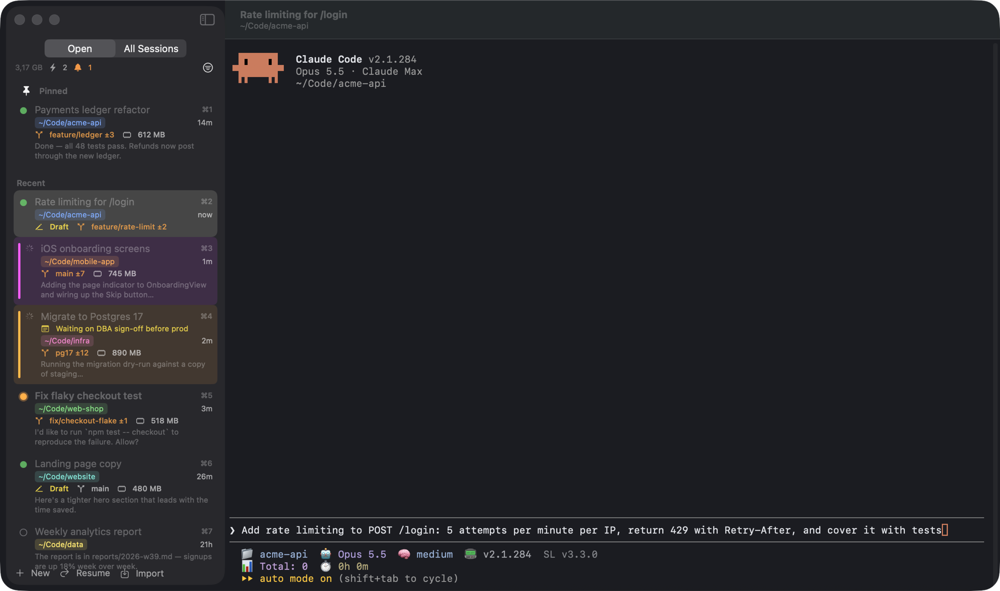

# Tabwise

**All your Claude Code sessions in one window.** Tabwise is a native macOS terminal built for people who run
many [Claude Code](https://docs.claude.com/en/docs/claude-code/overview) sessions at once: every session is a tab
in a sidebar with live status, and nothing is lost when you quit, restart, or move to a new Mac.

**[Download the latest version](https://github.com/bulgariamitko/tabwise/releases/latest)** · macOS 14 or later · Apple Silicon and Intel



## Features

**Sessions**
- Every Claude Code session is a tab: **working**, **waiting for you**, or **idle**, with notifications and a Dock badge when one finishes or needs input. <kbd>⌘J</kbd> jumps to the one that has waited longest.
- Sorted by the session you last messaged, or **grouped by folder** in collapsible groups that still show what's working inside.
- Pin, rename, color-label, add notes, archive, or **put a tab to sleep** to free its memory (it resumes where it was when you open it).
- **Import** the sessions you already have running in Terminal, or **resume** any session by pasting `claude --resume <id>` (flags are kept).
- **Split view**, <kbd>⌘K</kbd> quick switcher, menu bar icon with live counts.

**History**
- **All Sessions** lists every past conversation on your Mac with its title, folder and last message — with pins, full-text search (Latin and Cyrillic), and one-click resume.

**Never lose work**
- Tabs and their order, names, pins, notes and colors are restored after quitting or restarting; background tabs start only when you open them, so launch is fast.
- **Unsent prompts are saved**: text typed into Claude's input box but not sent yet survives a crash or restart.
- Optional **iCloud Drive backup** (or any folder, e.g. Dropbox) of Tabwise's data and your conversations; a new Mac restores everything on first launch.

**Terminal**
- Drop files or images onto a session to attach them; <kbd>⌘V</kbd> pastes clipboard images into Claude.
- Claude Code's voice mode works (hold Space to talk).
- Built-in [status line](https://github.com/bulgariamitko/claude-code-statusline): model, effort, rate limits, tokens, git and session time.
- Git branch and uncommitted changes, memory use per session, keep-Mac-awake while sessions work, saved prompts (<kbd>⌃⌘1</kbd>…<kbd>⌃⌘9</kbd>) and sending one prompt to several sessions.

## Install

1. Download `Tabwise-<version>.dmg` from [Releases](https://github.com/bulgariamitko/tabwise/releases/latest), open it and drag Tabwise to Applications.
2. Install Claude Code if you haven't: `curl -fsSL https://claude.ai/install.sh | bash`
3. Open Tabwise. It checks for Claude Code and offers to import the sessions you already have running.

Tabwise updates itself (Tabwise → Check for Updates…).

## Build from source

Requires Xcode 16 or later.

```sh
git clone https://github.com/bulgariamitko/tabwise.git
cd tabwise
./build.sh install      # builds build.noindex/Tabwise.app and copies it to /Applications
```

`./release.sh` builds a signed, notarized universal `.dmg` plus the Sparkle `appcast.xml` (needs a Developer ID certificate and notarization credentials — see the top of the script).

## Privacy

Tabwise runs entirely on your Mac. It reads Claude Code's own files in `~/.claude` to show session status and history, never sends your data anywhere, and has no analytics. The only network requests it makes are update checks against this repository's releases, and — only if you turn it on — the backup to your own iCloud Drive or folder.

## Credits

- [SwiftTerm](https://github.com/migueldeicaza/SwiftTerm) by Miguel de Icaza (MIT) — terminal emulation
- [Sparkle](https://sparkle-project.org) (MIT) — updates
- [claude-code-statusline](https://github.com/bulgariamitko/claude-code-statusline) (MIT) — the built-in status line

## License

[MIT](LICENSE) © 2026 Dimitar Klaturov

Tabwise is an independent project and is not affiliated with or endorsed by Anthropic. Claude and Claude Code are trademarks of Anthropic, PBC.
